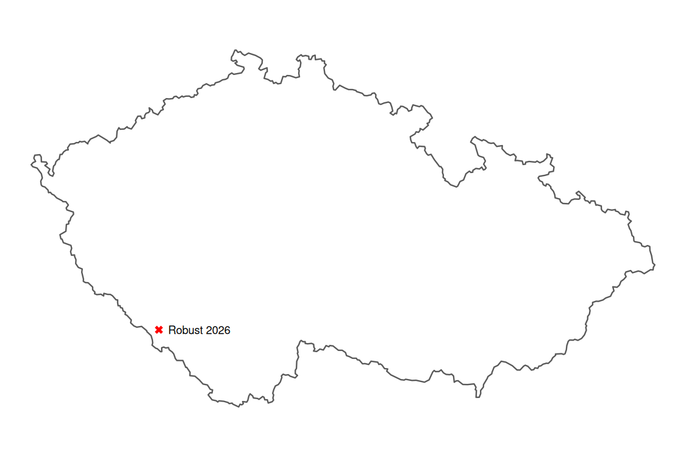

# robust-2026
🌐 Prostorová data v R - podpůrné materiály pro Robust 2026

  

Repozitář s materiály pro [Robust 2026](https://robust.nipax.cz/) v lednu 2026 na Šumavě.

Struktura repozitáře:
- `JLA-robust-prezka.odp` prezentace ve formátu Open Office Impress
- `/R/1-geocoding.R` získání dat a kreslení map / geocoding + {RCzechia}
- `/R/2-vánoční-kapr.R`získání dat a kreslení map / {czso} package 
- `/R/3-projekce.R` volba mapové projekce a její dopady
- `/R/4-geomarketing.R` geomarketing a získání dat z Open Street Maps
- `/R/5-dlouhověkost.R` modelování dlouhověkosti nad historickými censy
- `/R/6-matice-vzdáleností.R` konstrukce a využití vzdálenostní matice
- `/R/7-matice-sousedství.R` konstrukce a využití matic sousedství a vah
- `/R/8-využití-AI.R` extrakce lokalit a souřadnic z textu písně

